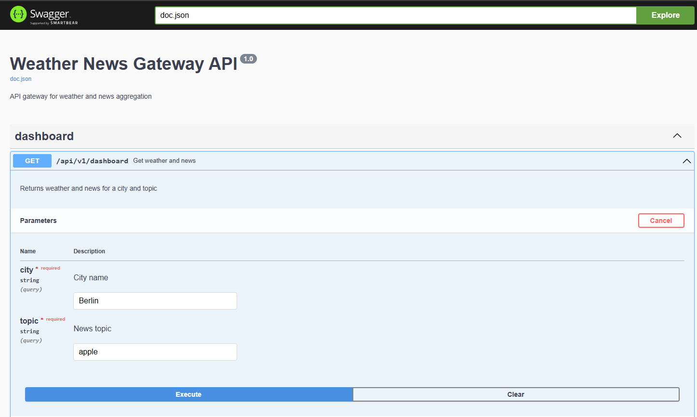
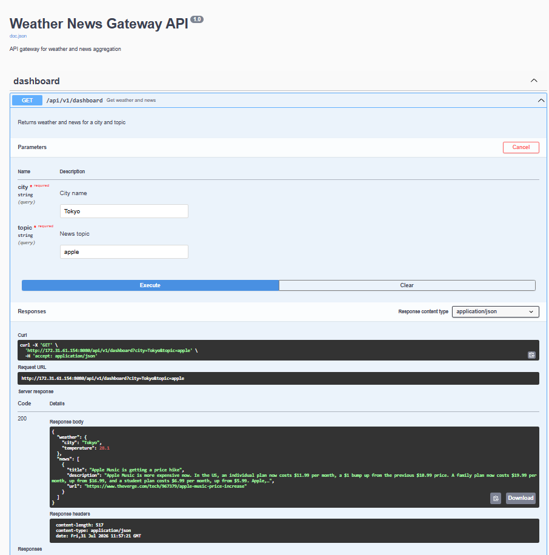

# Weather News Gateway


REST API на Go, который объединяет данные о погоде и новости из внешних сервисов.

## Возможности

- Получение погоды по городу
- Поиск координат через геокодирование
- Получение новостей по теме
- Кэширование запросов
- Swagger-документация
- Docker-запуск

## Технологии

- Go
- Chi Router
- Open-Meteo API
- NewsAPI
- Docker
- Docker Compose
- Swagger/OpenAPI
- GitHub Actions

## Запуск

Создать файл `.env`:

```bash
NEWS_API_KEY=your_key
```

Локальный запуск:

```bash
go run ./cmd/gateway
```
Запуск через Docker Compose:

```bash
docker compose up --build
```
Остановка:

```bash
docker compose down
```
Swagger:

```text
http://localhost:8080/swagger/index.html
```

## API

Получение погоды:

```http
GET /api/v1/weather?city=Tokyo
```

Получение новостей:

```http
GET /api/v1/news?topic=apple
```

Объединённый ответ:

```http
GET /api/v1/dashboard?city=Tokyo&topic=apple
```

## Архитектура

Проект разделён на несколько слоёв:

```text
weather-news-gateway/
│
├── cmd/
│ └── gateway/
│ └── main.go # запуск приложения и настройка сервера
│
├── internal/
│ ├── handler/ # HTTP обработчики API
│ ├── weather/ # клиент погодного сервиса
│ ├── news/ # клиент новостного сервиса
│ ├── geocoding/ # получение координат города
│ └── config/ # загрузка конфигурации
│
├── docs/ # Swagger-документация
├── screenshots/ # изображения для README
├── Dockerfile
├── docker-compose.yml
└── go.mod
```

Поток обрботки запроса:

```md
```text
Client
|
v
HTTP Handler
|
+--> Weather API
|
+--> Geocoding API
|
+--> News API
|
v
JSON Response
```

## Скриншоты

- Swagger UI



- Dashboard API response


